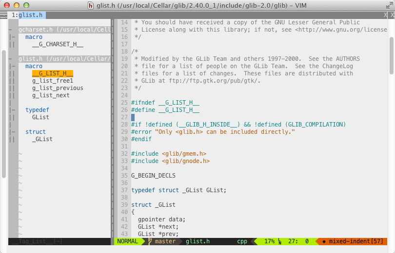

# About
`fvim` is a set of configurations and plug ins that I have collected over the years as a vim user.

I recently did a major long overdue upgrade, based on [this collection](https://github.com/amix/vimrc) by Amir Salihefendic, and [this blog post](http://items.sjbach.com/319/configuring-vim-right) by Stephen Bach.

# Usage
1. Clone this repo.
2. Change your `.vimrc` file to look like this:

		# Replace <FVIM_DIR> with the directory where
		# fvim is installed
		source <FVIM_DIR>/vimrc/vimrc.vim

3. Initialize the submodules

		git submodule init
		git submodule update

4. Install the `Meslo LG S for Powerline` font (from `tools/powerline-fonts`)
5. You need to install the Exuberant Ctags for `taglist.vim` to work.

		brew install ctags

6. If you need JavaScript autocomplete, be sure you have `npm` installed, and initialize `tern_for_vim`:

		brew install npm
		cd <FVIM_DIR>/sources/tern_for_vim
		npm install

# Screenshot

